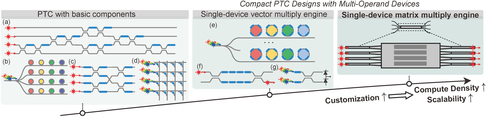
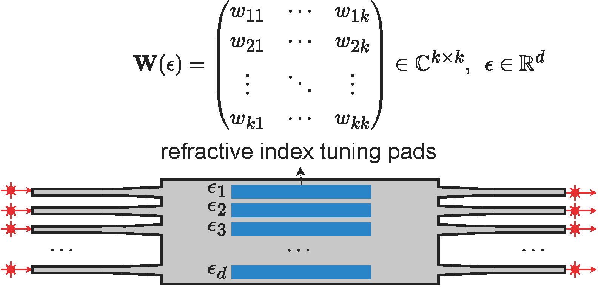
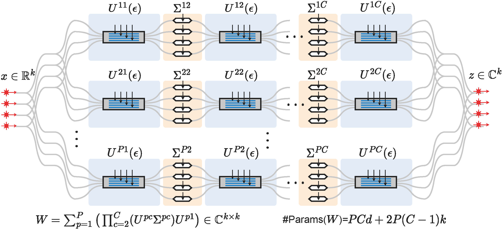

# M<sup>3</sup>ICRO-MOMMI

By [Jiaqi Gu](https://github.com/JeremieMelo), [Hanqing Zhu](https://github.com/zhuhanqing), [Chenghao Feng](https://github.com/Fengchenghao1996), Ray T. Chen and David Z. Pan.

This repo is the official implementation of ["M<sup>3</sup>ICRO: Machine Learning-Enabled Compact Photonic Tensor Core based on Programmable Multi-Operand Multimode Interference"](http://arxiv.org/abs/2305.19505).

[](https://opensource.org/licenses/MIT)

# Introduction
**M<sup>3</sup>ICRO** is an ultra-compact photonic tensor core design based on programmable multi-operand multimode interference (MOMMI).

<p align="center">
  
</p>
It consists of a multi-path tensor core topology with interleaved MOMMIs and modulators for coherent matrix multiplication.
<p align="center">
  
</p>
A machine learning-assisted training flow enables differentiable optimization of the control signals of MOMMIs.
A novel block unfolding method is proposed to allow efficient full-range real-to-real linear transform using coherent photonic tensor cores. 
<!-- <p align="center">
  

</p> -->


# Dependencies
* Python >= 3.10
* pyutils >= 0.0.1. See [pyutils](https://github.com/JeremieMelo/pyutility) for installation.
* pytorch-onn >= 0.0.5. See [pytorch-onn](https://github.com/JeremieMelo/pytorch-onn) for installation.
* Python libraries listed in `requirements.txt`
* NVIDIA GPUs and CUDA >= 11.7

# Structures
* configs/: configuration files
* core/
    * models/
        * layers/
          *  dpe_conv2d.py: Convolution layer definition
            * dpe_linear.py: Linear layer definition
            * dpe_layer_base.py: Base layer module
            * utils.py: Utility function
            * activation.py: Customized activation
        * dpe_nn_base.py: DPE neural network base module
        * dpe_resnet.py: DPE ResNet
        * dpe_mobilenet_v3.py: DPE MobileNetV3
        * resnet.py: Standard ResNet
        * mobilenet_v3.py: Standard MobileNetV3
        * dpe_base.py: Base module for NN-based device predictor
        * dpe.py: Module definition of NN-based device predictor
        * butterfly_utils.py: Customized modules for butterfly transform
        * utils.py: Utility functions
    * builder.py: Build training utilities
    * utils.py: Customized register hooks
* scripts/: contains experiment scripts
* data/: MMI simulation dataset
* train.py: training logic
* train_dpe.py: training logic for NN-based device predictor

# Usage
* Pretrain an ideal software digital ResNet20 on CIFAR10 as the teacher model:\
`python3 scripts/cifar10/resnet20/pretrain.py`
The pretrained checkpoint is available at `./checkpoint/cifar10/resnet20/ResNet20_CIFAR10_pretrain.pt`
* Simulated (Lumerical EME) transfer matrices of 4x4, 5x5, and 10x10 programmable MOMMIs are under `./data/mmi/raw/`
* Train NN-based differentiable device behavior estimator (DPE) on 4x4 MMI, \
`python3 scripts/mmi/dpe/train.py`
The trained checkpoint is under `./checkpoint/mmi/dpe/pretrain`.
The pretrained checkpoints are available under the above directory.
* Train `ResNet20` on 4x4 MOMMI-based PTC based on the trained DPE, \
`> python3 scripts/cifar10/resnet20/train_m3icro.py`
The training log is under `./log` and the trained checkpoint is under `./checkpoint/cifar10/resnet20/train`
* For comparison, butterfly and FFT-based PTCs can be trained as\
`python3 scripts/cifar10/resnet20/train_butterfly.py`

# Citing M<sup>3</sup>ICRO
```
@article{gu2023M3ICRO,
  title={M3ICRO: Machine Learning-Enabled Compact Photonic Tensor Core based on PRogrammable Multi-Operand Multimode Interference},
  author={Jiaqi Gu and Hanqing Zhu and Chenghao Feng and Zixuan Jiang and Ray T. Chen and David Z. Pan},
  journal={APL Machine Learning},
  year={2024}
}
```
